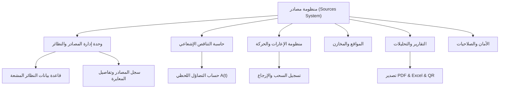

# 📋 خطة عمل وتطوير منظومة "مصادر | Sources" — النسخة النهائية المعتمدة

> **ملاحظة هامة قبل البدء:** هذه ليست خطة بناء نظام من الصفر. المنظومة **موجودة ومبنية بالفعل** (مبنية على أساس مشروع MASAR مفتوح المصدر)، وتمت بالفعل إعادة تسميتها بالكامل برمجياً وبصرياً إلى "مصادر". هذه الخطة توضح ما **تم إنجازه فعلياً**، وما هو **المطلوب من Antigravity IDE تحديداً** لإكمال المهمة والتحقق منها.

---

## 0️⃣ تعليمات إلزامية لـ Antigravity IDE قبل أي تنفيذ

1. **أنشئ مجلد مشروع جديد ومنفصل تماماً باسم المنظومة الجديدة** (مثال: `Sources-System` أو `مصادر-System`) — **لا تُعدّل أو تكتب فوق أي مشروع MASAR قديم موجود لديك**. المرفقات في هذه الحزمة هي نقطة البداية الرسمية للمشروع الجديد.
2. **الشعار والهوية البصرية جاهزان ونهائيان — لا تُعد توليدهما.** كل الأصول (الشعار الشفاف، أيقونة التطبيق `.ico`، خلفية شاشة الدخول، لوحة الألوان) موجودة جاهزة داخل مجلد `Brand-Kit/` والمشروع نفسه في `Assets/`. أي محاولة لتوليد شعار جديد بالذكاء الاصطناعي ستتعارض مع الهوية المعتمدة فعلياً في كل شاشات النظام.
3. **الـ namespace البرمجي تم تغييره بالفعل** من `MASAR` إلى `Sources` في 85 ملف. لا تبحث عن أو تفترض وجود اسم `MASAR` في الكود.
4. **أول خطوة فعلية مطلوبة:** `dotnet restore` ثم `dotnet build` للتأكد من سلامة المشروع بعد كل التعديلات، قبل أي تطوير إضافي.

---

## 1️⃣ الرؤية والهدف العام للمنظومة

تطوير نظام برمجي متكامل وعصري لإدارة وتتبع المصادر والنظائر المشعة في المنشآت والمختبرات والمستشفيات، يهدف إلى:
* **التتبع الدقيق:** تسجيل وتتبع حركة المصادر الإشعاعية ومواقعها وسجل حيازتها.
* **الحساب التلقائي:** تتبع النشاط الإشعاعي اللحظي بناءً على قوانين التناقص الإشعاعي وعمر النصف.
* **الامتثال الرقابي:** تطبيق معايير الأمان والسلامة الإشعاعية واستخراج تقارير التفتيش والرقابة.

---

## 2️⃣ الحالة الحالية للهوية البصرية (منجزة بالكامل ✅)

### الفلسفة والرمزية (كما صُمم الشعار فعلياً)
* **الرمز الأساسي:** دمج بين **درع الأمان** (الحماية والسلامة) و**المدار الذري** (الفيزياء الإشعاعية).
* **النص المزدوج:** "مصادر" بالعربية و"Sources" بالإنجليزية بخط هندسي حديث.
* **لوحة الألوان المطبّقة فعلياً في `Resources/Colors.xaml`:**

| اللون | المفتاح (Key) | القيمة (Hex) | الاستخدام |
|---|---|---|---|
| أزرق بترولي دافئ (Primary) | `PrimaryColor` | `#1F5A66` | اللون الأساسي للمنظومة، الخلفيات الرئيسية، الأزرار |
| أزرق بترولي فاتح | `PrimaryLightColor` | `#3D7C89` | التدرجات اللونية وحالات التحويم (Hover) |
| أزرق بترولي داكن | `PrimaryDarkColor` | `#123840` | الشريط الجانبي والترويسات الداكنة |
| تراكوتا دافئ (Gem Blue / Accent) | `GemBlueColor` | `#C97A4A` | اللون الثانوي المميز — شارات، رسوم بيانية |
| تراكوتا داكن | `GemBlueDarkColor` | `#A25C34` | حالات التفاعل والتركيز للون الثانوي |
| أخضر زمردي (Success) | `SuccessColor` | `#3FAE7A` | حالات النجاح، الأمان، العمليات المكتملة |
| ذهبي تحذيري (Warning) | `WarningColor` | `#E0A93E` | تنبيهات انخفاض النشاط، الحالات التحذيرية |
| أحمر سلامة (Danger) | `DangerColor` | `#C25B4A` | التنبيهات الحرجة، الحذف، ونقاط الحساب بالرسوم |
| أزرق فولاذي (Info) | `InfoColor` | `#4F7FA3` | عناصر المعلومات والإحصائيات |

### الأصول الجاهزة (في `Brand-Kit/` وداخل `Assets/` بالمشروع)
- `sources_logo.png` — الشعار الكامل شفاف الخلفية
- `sources_sidebar_logo.png` — أيقونة الدرع فقط (للاستخدام في المساحات الصغيرة)
- `sources_icon.ico` — أيقونة التطبيق متعددة الأحجام
- `sources_login_branding.jpg` — خلفية شاشة الدخول الجاهزة

### الشاشات المطبّق عليها الهوية فعلياً
شاشة تسجيل الدخول، الشريط الجانبي، صفحة "عن المنظومة"، أيقونة التطبيق، جميع النصوص الظاهرة للمستخدم (عربي/إنجليزي).

**المطلوب من Antigravity في هذا الجزء فقط:** مراجعة التكامل البصري (لا إعادة التصميم) — التأكد من عدم وجود شاشة منسية لم تُطبّق عليها الهوية بعد.

---

## 3️⃣ الخطة البرمجية وتقنيات المنظومة

### Stack التقني المعتمد (يجب الالتزام به دون تغيير)
| الطبقة | التقنية |
|---|---|
| الواجهة | WPF (.NET 8, `net8.0-windows`) |
| نمط التصميم | MVVM (`CommunityToolkit.Mvvm`) |
| قاعدة البيانات | SQLite عبر `Microsoft.EntityFrameworkCore.Sqlite` |
| مكتبة الواجهة | MaterialDesignThemes / MaterialDesignColors |
| الرسوم البيانية | LiveChartsCore.SkiaSharpView.WPF |
| التقارير | QuestPDF (PDF), ClosedXML (Excel), QRCoder (QR) |
| الأمان | BCrypt.Net-Next (تشفير كلمات المرور) |



### 1. وحدة النظائر والمصادر المشعة (Radioisotopes & Sources Module)
* قاعدة بيانات شاملة للنظائر المشعة مع فترة عمر النصف ($T_{1/2}$)، نوع الإشعاع ($\alpha, \beta, \gamma, n$)، وطاقات غاما.
* سجّل المصادر الإشعاعية: كود المصدر، الرقم التسلسلي، المصنّع، تاريخ المعايرة، والنشاط الإشعاعي الابتدائي.

### 2. محرك حاسبة النشاط والتناقص الإشعاعي (Decay Calculator Engine)
* تطبيق صيغة الفيزياء الإشعاعية:
$$A(t) = A_0 \times e^{-\lambda t} \quad \text{where} \quad \lambda = \frac{\ln(2)}{T_{1/2}}$$
* حساب النشاط الحالي تلقائياً لحظة بلحظة لكافة المصادر المسجلة مع تحويل الوحدات (Bq, Ci, mCi, µCi, MBq, GBq, TBq).

### 3. نظام الإعارات والمتابعة (Borrow & Movement Tracker)
* تسجيل طلبيات السحب والإعارة للمصادر، تحديد المستعير، تاريخ الإعادة المتوقع، وتتبع حالة المصدر (متاح، مُعار، مستهلك، نفايات).

### 4. إدارة الموقع والتخزين (Locations & Storage Management)
* تصنيف المباني، الغرف، والمخازن وتوزيع المصادر داخل المنشأة مع قراءات معدل الجرعة والتصنيف الرقابي.

### 5. التقارير والطباعة والباركود (Reports & Export Engine)
* استخراج تقارير شحنات ومخزون المصادر بصيغة PDF معتمدة.
* توليد وتصدير ملفات Excel.
* توليد رموز الاستجابة السريعة (QR Code) وطباعتها على الملصقات الخاصة بالمصادر.

**حالة هذه الوحدات:** موجودة وشغالة بالفعل في الكود المرفق (`Services/`, `ViewModels/`) بأسماء متوافقة (`SourceService`, `DecayCalculationService`, `BorrowService`, `LocationService`, `ReportingService`). المطلوب من Antigravity: **مراجعة واستكمال**، وليس بناء من الصفر.

---

## 4️⃣ ما تم إنجازه فعلياً (Checklist)

- [x] استنساخ وتحليل بنية مشروع MASAR الأصلي
- [x] استخراج الشعار الجديد وتجهيزه (شفافية، قصّ الأيقونة، خلفية دخول)
- [x] تحديث لوحة الألوان (`Colors.xaml`) بلون إشعاعي ثالث جديد
- [x] استبدال كل النصوص المرئية (عربي/إنجليزي) من "مسار/MASAR" إلى "مصادر/Sources"
- [x] إعادة تصميم شاشة تسجيل الدخول بالكامل
- [x] تحديث الشريط الجانبي وصفحة "عن المنظومة" وأيقونة التطبيق
- [x] إعادة تسمية الـ namespace البرمجي بالكامل من `MASAR` إلى `Sources` (85 ملف، 278 موضع)
- [x] إعادة تسمية ملف المشروع إلى `Sources.csproj`
- [x] فحوصات سلامة XML/بنية الأقواس على كل الملفات المعدّلة

## 5️⃣ ما هو مطلوب من Antigravity IDE تحديداً (المراحل القادمة)

| المرحلة | المهمة | الأولوية |
|---|---|---|
| 1 | إنشاء مجلد مشروع جديد ونقل الملفات المرفقة إليه | 🔴 عالية |
| 2 | `dotnet restore` + `dotnet build` والتأكد من عدم وجود أخطاء | 🔴 عالية |
| 3 | التحقق من `Migrations/` (EF Core) — إعادة توليدها إذا لزم الأمر | 🔴 عالية |
| 4 | تشغيل التطبيق فعلياً واختبار شاشة الدخول والتنقل بين كل الشاشات | 🟡 متوسطة |
| 5 | مراجعة أي نص متبقٍ مكتوب مباشرة بالكود (hardcoded) لم يُنقل بعد لملفات الترجمة | 🟡 متوسطة |
| 6 | استكمال أي وحدة وظيفية ناقصة حسب القسم 3️⃣ أعلاه | 🟢 حسب الحاجة |

---

## 6️⃣ خطة التحقق والاعتماد (Verification & Quality Plan)

* **بناء المشروع أولاً:** لا تنتقل لأي اختبار آخر قبل التأكد من نجاح `dotnet build` بدون أخطاء.
* **اختبارات دقة الحسابات الإشعاعية:** مطابقة نتائج التناقص الإشعاعي في المنظومة مع الجداول المعيارية الدولية للسلامة الإشعاعية (IAEA).
* **اختبارات واجهة المستخدم:** التأكد من سلاسة التصفح بدعم كامل للغة العربية والإنجليزية وحالة المظهر الداكن/الفاتح، وأن الهوية البصرية الجديدة ظاهرة وصحيحة في كل شاشة.
* **جاهزية قاعدة البيانات:** التحقق من استقرار الهيكلية وقدرتها على استيعاب آلاف السجلات.

---

## 7️⃣ محتويات الحزمة المرفقة

```
Sources-System/
├── implementation_plan_final.md      ← هذا الملف
├── Sources-System-Project/           ← المشروع الكامل (الكود + الأصول مدمجة بالفعل)
└── Sources-Brand-Kit/                ← نسخة منفصلة من ملفات الهوية البصرية فقط
    ├── Logo/
    └── Login-Screen/
```

---

## 8️⃣ آخر تحديث (Latest Status)

* **Commit Hash:** `6173f51`
* **التاريخ:** 16 أغسطس 2026
* **آخر عمل منجز:** توحيد تنسيق تلميحات الرسوم البيانية (Tooltips) — عرض التاريخ والوحدة بشكل صحيح — في منحنى التحلل بحاسبة النشاط ولوحة التحكم، عبر `XToolTipLabelFormatter` و `YToolTipLabelFormatter`. (ملاحظة: إعادة تصميم البطاقة لدعم تعدد النويدات والمحاور الديناميكية لكل مصدر لا تزال مطلوبة مستقبلاً ولم تُنفَّذ بعد).

